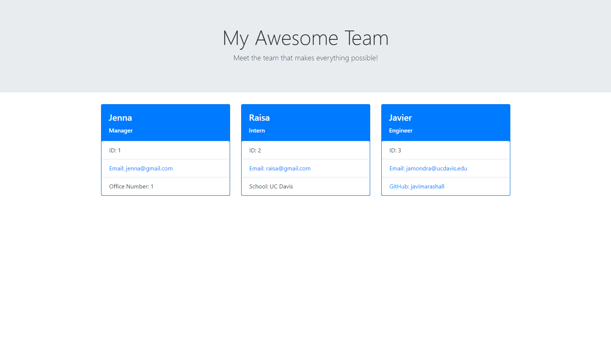

# Team-Profile-Generator

## Summary
This application contains a team profile generator based on user input. This application allows a user to create a team comprised of a manager, engineers, and interns. The user is able to create a manager profile at the start of the application based on prompt questions generated. When the user is done generating the manager, then the user is prompted with choices of who to create next, an engineer, intern, or quit the application. If the user selects to create an engineer, than the user is prompted with the engineer questions or questions to create an intern. If the user selects to quit, then the application will move forward to write to file the employees that were created. The application writes those files to an HTML page created to display the new employee profiles.  



## Technologies Used
* HTML - Used for displaying the outcome of the application
* Javascript - Used to write in Node
* Package.json - Used to identify the project and the dependencies
* Package-lock.json - Automatically created for operations where npm modifies  package.json
* Inquire - Used to prompt user with questions
* Node.js - Used to to write server-side application
* Npm - Used to obtain software packages
* Jest - Used for testing of the application

## Installation
In order to run this application, the user needs to install node.js, npm install inquire, and npm install jest. 
## Code Snippet
This code snippet represents one of the test that were done as the application was created. The tests were used to make sure the application was doing what it was supposed to before completion. 
```java
const Employee = require("../lib/employee")

describe("Employee class", () => {
    it("Test get methods", () => {
        const employee = new Employee("javier", "10", "jamondragon@ucdavis.edu");
        expect(employee.getName()).toBe("javier");
        expect(employee.getId()).toBe("10");
        expect(employee.getEmail()).toBe("jamondragon@ucdavis.edu");
    });
})
```
## Repository Link
https://github.com/javimarashall/Team-Profile-Generator

## Video Link
https://drive.google.com/file/d/1iJr8AfCTdLmaQID6xa24or03ommLfOqY/view
## Personal Links
[Github](https://github.com/javimarashall)<br>
[Linkedin](https://www.linkedin.com/in/javier-mondragon-7b471719b/)